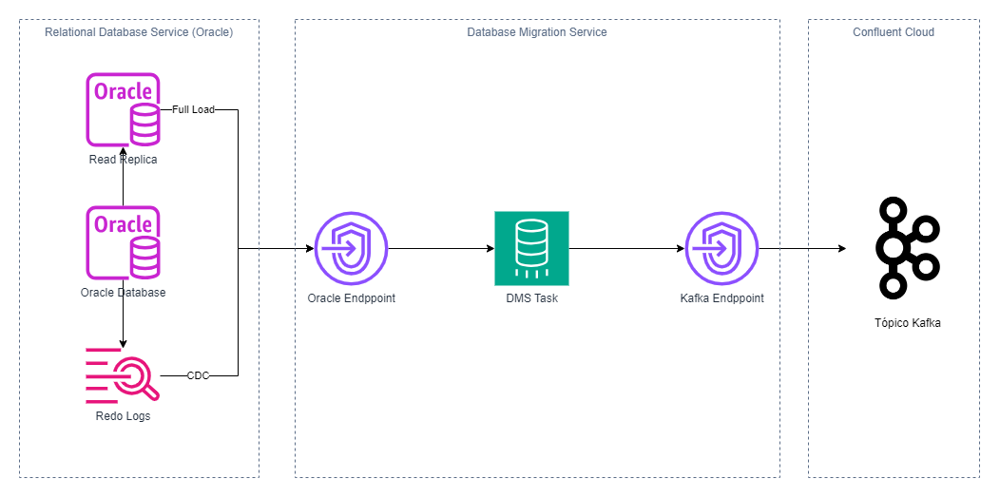

# Documentação: Configuração de CDC (Change Data Capture) com AWS DMS, Oracle e AWS MSK

## 1.Objetivo

Este documento descreve a arquitetura e a configuração do pipeline de CDC (Change Data Capture) que replica dados de um banco de dados Oracle para o AWS MSK (Managed Streaming for Kafka) usando o AWS DMS (Database Migration Service). Ele detalha as configurações necessárias tanto para o DMS quanto para as dependências (Oracle e MSK).

## 2.Visão Geral da Arquitetura

- **Descrição:** Breve descrição do fluxo de dados, desde o Oracle (origem) até o MSK (destino), utilizando o AWS DMS como orquestrador.
- **Componentes:**
    - **Oracle:** Banco de dados relacional que serve como fonte de dados para a replicação.
    - **AWS DMS:** Serviço que captura as mudanças de dados (CDC) no Oracle e as replica para o MSK.
    - **AWS MSK:** Serviço de streaming gerenciado pelo Kafka, para onde os dados replicados serão enviados.
- **Diagrama:**

## 3.Configuração de Dependências
Este bloco descreve as configurações necessárias para que o AWS DMS funcione corretamente. O bloco foi dividido em duas subseções.

### 3.1. Banco de Dados Oracle

- **Pré-requisitos:**
    - **Versão do Oracle:** Especificar as versões suportadas e a compatibilidade com DMS.
    - **Redo Logs:** Ativar o arquivamento de redo logs (Archive Logging) e configurar o tamanho adequado.
    - **Suplemental Logging:** Ativar o "supplemental logging" no nível do banco de dados e das tabelas que serão replicadas.
        - `ALTER DATABASE ADD SUPPLEMENTAL LOG DATA;`
        - `ALTER TABLE <schema>.<table_name> ADD SUPPLEMENTAL LOG DATA (ALL) COLUMNS;`
    - **Usuário do DMS:** Criar um usuário dedicado para o DMS com privilégios suficientes para leitura das tabelas a serem replicadas e acesso aos redo logs.
        - `CREATE USER dms_user IDENTIFIED BY dms_user_password;`
        - `GRANT CREATE SESSION, SELECT_CATALOG_ROLE TO dms_user;`
        - `GRANT SELECT ANY TRANSACTION, LOGMINING TO dms_user;`
        - `GRANT SELECT ON <schema>.<table_name> TO dms_user;`
        - E conceder as permissoes para as tabelas que serão replicadas
    - **Conectividade:**  Configurar a conectividade de rede entre o AWS DMS e o banco de dados Oracle (ex: utilizando VPN, Direct Connect ou Security Groups).
    - **Porta**: A porta padrão do oracle é a 1521, mas deve ser consultada a porta configurada no ambiente.
- **Parâmetros de conexão**:
    - **db_name**: `ORCLDEV` - Nome do banco de dados.
    - **db_endpoint**: `oracle-dev.example.com` - Endpoint do banco de dados.
    - **db_username**: `dms_user` - Usuário do DMS.
    - **db_password**: `dms_user_password` - Senha do usuário do DMS.
    - **db_port**: `1524` - Porta do banco de dados.

### 3.2. AWS MSK (Managed Streaming for Kafka)
- **Pré-requisitos:**
    - **Cluster MSK:** Criar um cluster MSK na mesma região do AWS DMS e na mesma VPC ou em VPCs conectadas.
    - **Configuração de Segurança:** Configurar security groups adequados para permitir o tráfego entre o DMS e o cluster MSK.
    - **Autenticação:** Configurar a autenticação entre o DMS e o MSK. É recomendado utilizar SASL/SCRAM.
        - kafka_username: kafka-user-dev - Usuário do Kafka.
        - kafka_password: kafka-password-dev - Senha do Kafka.
    - **Configuração do Kafka:** Definir as configurações do cluster Kafka, como número de brokers, tamanho do armazenamento, retenção de dados, etc.
    - **Configuração do tópico:** Criar os tópicos no Kafka que irão receber os dados do banco. O tópico irá seguir o padrão, especificado em kafka_topic_prefix, seguido do nome da tabela.
- **Parâmetros de conexão:**
    - **kafka_bootstrap_brokers:** kafka-dev-01.example.com:9092,kafka-dev-02.example.com:9092,kafka-dev-03.example.com:9092 - Lista de endpoints dos brokers do Kafka.
    - **kafka_topic_prefix:** dms-cdc-dev - Prefixo dos tópicos.

## 4.Configuração do AWS DMS (Pasta cdc)

Esta seção aborda os detalhes sobre a configuração do AWS DMS.

- **4.1. Instância de Replicação (Replication Instance)**
    - **Tipo de Instância:** Recomendações para o tipo de instância DMS (ex: `dms.t3.small` para desenvolvimento/teste, `dms.c5.xlarge` para produção).
    - **VPC:** Especificar a VPC onde a instância de replicação será criada (`vpc-0abcdef1234567890`). Ela deve ter conectividade tanto com o MSK como com o Oracle
    - *Allocated Storage:** Definir o armazenamento necessário para a instância.
    - **Multi-AZ:** Considerações sobre a utilização de Multi-AZ para alta disponibilidade.
- **4.2. Endpoints**
    - **Endpoint de Origem (Source Endpoint - Oracle):**
        - **Tipo:** `oracle`
        - **Parâmetros de Conexão:** Detalhar os parâmetros de conexão com o Oracle, como endpoint, porta, usuário, senha e nome do banco. (Ver item 2.1)
    - **Endpoint de Destino (Target Endpoint - Kafka):**
        - **Tipo:** `kafka`
        - **Parâmetros de Conexão:** Detalhar os parâmetros de conexão com o MSK, como os brokers, username, password, e o prefixo dos tópicos. (Ver item 2.2)
**4.3. Tarefa de Replicação (Replication Task)**
    - **Tipo de Tarefa:** `Full load and ongoing replication` (para uma carga inicial e replicação contínua).
    - **Tabelas:** Definir as tabelas e os schemas que serão replicados.
        - `replicated_tables`:
            - `schema`: `"SCHEMA_A"` e `"SCHEMA_B"`- Esquemas no banco de dados Oracle.
            - `tables`: `["TABLE_1", "TABLE_2"]` e `["TABLE_3"]` - Tabelas que serão replicadas.
    - **Transformações:**  Configurar transformações caso seja necessário alterar o formato de dados.
    - **Mapeamento de Dados:** Mapear os tipos de dados do Oracle para o Kafka, considerando o formato de mensagem (ex: JSON, Avro).
    - **Seleção de tabelas:** Definir as regras de seleção de tabelas, permitindo a inclusão ou exclusão de tabelas específicas.
    - **Configurações Avançadas:** Detalhar configurações como commit rate, tamanho da transação, etc.
